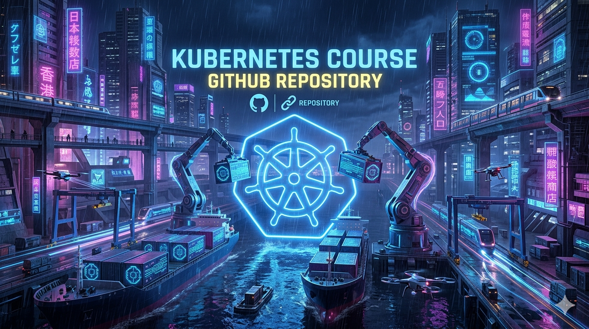

# Kubernetes Course Submissions by Elar Saks

This repository contains my submissions for the [**DevOps with Kubernetes** MOOC](https://courses.mooc.fi/org/uh-cs/courses/devops-with-kubernetes) offered by the University of Helsinki.  

## Exercises

### Chapter 2
- [1.1. Log Output](https://github.com/elarsaks/kubernetes-course-submissions/tree/1-1/log_output)

---

📌 *More chapters and exercises will be added as I progress through the course.*
