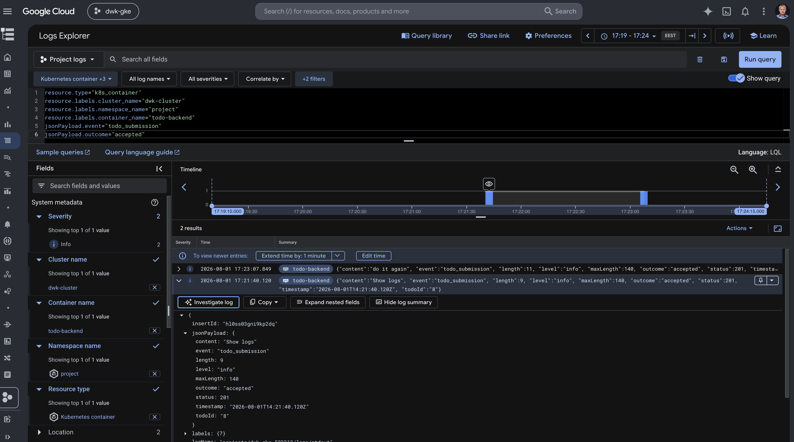

# Exercise 4.9 - The Project, Step 25

The Todo project has staging and production Kustomize overlays in separate
namespaces. Commits to the default branch update staging, while Git tags update
production. Staging logs broadcaster messages and excludes database backups;
production forwards messages and retains the backup CronJob.

Secrets are applied outside ArgoCD.

```bash
kubectl apply -f argocd/project-staging-application.yaml
kubectl apply -f argocd/project-production-application.yaml
```

---

# Exercise 4.8 - The Project, Step 24

The complete Todo project now uses GitOps. ArgoCD watches the repository root
on the `master` branch and automatically applies the root `kustomization.yaml`
to the local Kubernetes cluster.

When project code or manifests change, GitHub Actions builds and publishes the
frontend, backend, generator, backup, and broadcaster images. It then commits
the new commit SHA image tags to the root Kustomization. ArgoCD detects that
Git change and synchronizes the project.

## Local ArgoCD deployment

Install NATS and create the Generic broadcaster Secret before syncing the
project:

```bash
helm repo add nats https://nats-io.github.io/k8s/helm/charts/
helm repo update
helm upgrade --install my-nats nats/nats \
  --namespace nats \
  --create-namespace

kubectl create namespace project --dry-run=client --output=yaml | kubectl apply -f -
kubectl apply -f broadcaster/manifests/test-receiver.yaml
kubectl create secret generic broadcaster-secret \
  --namespace project \
  --from-literal=BROADCAST_URL=http://webhook-test-receiver:8080
```

Apply the ArgoCD Application:

```bash
kubectl apply -f argocd/the-project-application.yaml
kubectl get application the-project -n argocd
```

The Application uses automated sync, pruning, and self-healing. The
`broadcaster-secret`, NATS installation, and runtime configuration are
intentionally kept outside Git.

## GitHub Actions configuration

The `project-gitops.yaml` workflow uses the repository secrets
`DOCKERHUB_USERNAME` and `DOCKERHUB_TOKEN`. It publishes all project images
with the commit SHA as the tag and updates the root `kustomization.yaml`.

The `[skip ci]` marker on the generated commit prevents an image-build loop.

## Verify

```bash
kubectl get application the-project -n argocd
kubectl get pods -n project
kubectl rollout status deployment/the-project -n project --timeout=10m
kubectl rollout status deployment/todo-backend -n project --timeout=10m
kubectl rollout status deployment/todo-broadcaster -n project --timeout=10m
```

The local manifests use k3d's `local-path` storage class. The application
must be running in the `project` namespace, and NATS must be available at the
service address configured in `the_project/manifests/configmap.yaml`.

---

# Exercise 4.6 - The Project, Step 23

The project now publishes Todo status events to NATS whenever a Todo is
created or updated. A separate six-replica broadcaster consumes those events
through the `broadcasters` queue group, so each event is handled by only one
broadcaster Pod.

The broadcaster uses the exercise's **Generic** external service option. It
sends a POST request to the URL in `BROADCAST_URL` with JSON like:

```json
{
  "user": "bot",
  "message": "A todo was created",
  "todo": {
    "id": 1,
    "content": "Learn Kubernetes",
    "done": false
  }
}
```

## Deploy NATS and the Generic broadcaster

Install NATS before applying the project:

```bash
helm repo add nats https://nats-io.github.io/k8s/helm/charts/
helm repo update
helm upgrade --install my-nats nats/nats --namespace nats --create-namespace
```

Create the Generic webhook Secret in the project namespace. Replace the URL
with the endpoint of the service receiving the notifications:

```bash
kubectl create namespace project --dry-run=client --output=yaml | kubectl apply -f -
kubectl create secret generic broadcaster-secret \
  --namespace project \
  --from-literal=BROADCAST_URL=https://example.invalid/todos
kubectl apply -k .
```

Verify the required six replicas and test the queue-based scaling:

```bash
kubectl scale deployment/todo-broadcaster --replicas=6 -n project
kubectl rollout status deployment/todo-broadcaster -n project --timeout=10m
kubectl get pods -l app=todo-broadcaster -n project
```

Create or update a Todo and inspect the broadcaster logs. Only one replica
should log each delivered NATS event:

```bash
kubectl logs -l app=todo-broadcaster -n project --prefix

curl -X POST http://localhost:3000/todos \
  -H 'Content-Type: application/json' \
  -d '{"content":"Send a status update"}'
```

The backend and broadcaster use `NATS_URL` and `NATS_SUBJECT` from the shared
project ConfigMap. The event subject is `todos.status`.

The broadcaster's queue behavior can also be tested automatically without a
Kubernetes cluster. The test starts a temporary NATS container, six
broadcaster processes, and a local Generic webhook receiver, then publishes
100 events and asserts that every event is delivered exactly once:

```bash
cd broadcaster
npm ci
npm run test:integration
```

This verifies the no-duplicates property. The exercise allows missing
messages when a service is unhealthy; the broadcaster logs webhook failures
and does not retry them.

For the same test inside a local Kubernetes cluster, deploy the included test
receiver and point the broadcaster Secret to its Service:

```bash
kubectl apply -f broadcaster/manifests/test-receiver.yaml
kubectl create secret generic broadcaster-secret \
  --namespace project \
  --from-literal=BROADCAST_URL=http://webhook-test-receiver:8080
kubectl apply -k .
kubectl rollout status deployment/todo-broadcaster -n project
```

After creating test Todos, inspect the received payloads with:

```bash
kubectl logs deployment/webhook-test-receiver -n project | grep '^WEBHOOK '
```

---

The Todo application now supports completing a Todo through
`PUT /todos/<id>`. The backend persists a `done` boolean with a default of
`false`, and the frontend displays a **Mark done** button for unfinished
Todos. Completed Todos are rendered with a strikethrough and a **Done** label.

The API request body is:

```json
{"done": true}
```

The backend returns the updated Todo, including `id`, `content`, and `done`.
Updating an unknown Todo returns `404`, and a non-boolean `done` value returns
`400`.

## Local verification

After deploying the project, create a Todo and use the returned ID:

```bash
curl -i -X PUT http://localhost:3000/todos/1 \
  -H 'Content-Type: application/json' \
  -d '{"done":true}'
```

The response should contain `"done":true`. Refreshing the frontend should
show that Todo with a strikethrough and a **Done** label.

The frontend now exposes Kubernetes health endpoints and has both probes in
its Deployment:

- `/readyz` verifies that the Todo backend can be reached, which means the
  application can use its PostgreSQL database through the backend.
- `/healthz` reports whether the frontend process is healthy.

The **break the app** button sends `POST /break`. This intentionally makes the
health and readiness endpoints fail and makes normal frontend requests return
HTTP 503. Kubernetes removes the Pod from the Service through the failed
readiness probe and restarts it through the failed liveness probe. The new Pod
starts with a healthy state again.

## Local verification

Apply the project to a local k3d cluster and wait for the frontend rollout:

```bash
kubectl apply -k .
kubectl rollout status deployment/the-project -n project --timeout=10m
```

Confirm both probes succeed:

```bash
kubectl exec deployment/the-project -n project -- \
  node -e 'Promise.all([fetch("http://localhost:3000/healthz"), fetch("http://localhost:3000/readyz")]).then(async ([health, ready]) => console.log(health.status, ready.status))'
```

The command prints `200 200`. Open the frontend through its local Service or
Ingress and press **break the app**. The Pod's restart count should increase,
and after the restart the Pod should return to `1/1` with both probes passing.

## Exercise 3.12 - The Project, Step 20

The Todo application is automatically built, published, and deployed to a
separate Google Kubernetes Engine namespace for each branch.

## Application

The root Kustomization deploys the complete project into the namespace chosen
by the workflow:

- Todo frontend
- Todo backend
- Six-replica Generic Todo broadcaster
- PostgreSQL
- Hourly Wikipedia Todo generator
- Persistent image and database storage
- Service and Ingress resources

The persistent volume claims use k3d's `local-path` storage class. The
frontend Deployment uses the `Recreate` strategy so two Pods do not compete
for its `ReadWriteOnce` image-cache volume during an update.

## Deployment pipeline

The GitHub Actions workflow in `.github/workflows/main.yaml`:

1. Authenticates to Google Cloud through Workload Identity Federation.
2. Builds the frontend, backend, generator, and broadcaster images.
3. Pushes commit-tagged images to the `kubernetes-course` Artifact Registry
   repository.
4. Replaces the Kustomize image mappings with the published image names.
5. Creates a namespace for the branch and sets it as the Kustomize namespace.
6. Applies the complete project to `dwk-cluster`.
7. Waits for PostgreSQL, backend, frontend, and broadcaster rollouts to complete.

Image tags contain the branch name and commit SHA, making every deployment
traceable to its source commit.

The `master` branch is always deployed to the `project` namespace. Other
branches use a sanitized version of their branch name as the namespace, for
example `feature/demo` becomes `feature-demo`.

## Branch cleanup

The `.github/workflows/delete-environment.yaml` workflow listens for deleted
branches. It ignores tag deletions and `master`, derives the same namespace
name used by the deployment workflow, and deletes that namespace from GKE.

Deleting a branch therefore removes its Deployments, Services, Ingress, and
persistent volume claims with the namespace.

The workflow uses the GitHub environment `GKE_PROJECT` with these environment
secrets:

- `GKE_PROJECT`
- `SERVICE_ACCOUNT`
- `WORKLOAD_IDENTITY_PROVIDER`

The CI service account can write to the course's Artifact Registry repository
and deploy to the GKE cluster.

## Manual deployment

Configure `kubectl`, inspect the rendered resources, and apply them from the
repository root:

```bash
gcloud container clusters get-credentials dwk-cluster \
  --project=dwk-gke-503313 \
  --zone=europe-north1-b

kubectl kustomize .
kubectl create namespace project --dry-run=client --output=yaml | kubectl apply -f -
kubectl apply -k .
```

Verify the deployment:

```bash
kubectl rollout status statefulset/todo-postgres -n project --timeout=10m
kubectl rollout status deployment/todo-backend -n project --timeout=10m
kubectl rollout status deployment/the-project -n project --timeout=10m
kubectl get pods,pvc,svc,ingress -n project
```

When the Ingress has an external address, test the application:

```bash
PROJECT_IP="$(kubectl get ingress the-project \
  -n project \
  -o jsonpath='{.status.loadBalancer.ingress[0].ip}')"

curl -i "http://${PROJECT_IP}/"
```

A successful deployment returns `HTTP/1.1 200 OK` and the Todo application
HTML.

## DBaaS vs DIY PostgreSQL

The current project uses a DIY PostgreSQL deployment: a one-replica
`StatefulSet` with a `ReadWriteOnce` persistent volume claim. A reasonable
DBaaS alternative on GCP would be Cloud SQL for PostgreSQL.

| Area | DIY PostgreSQL in GKE | DBaaS (Cloud SQL) |
| --- | --- | --- |
| Initialization | Apply the StatefulSet, Service, Secret, and PVC manifests. This is quick and fits naturally into the existing Kustomize deployment, but storage, credentials, readiness, and upgrade decisions are ours. | Create a Cloud SQL instance, database, user, network/private-IP connectivity, and Kubernetes Secret. This usually takes more initial configuration and the instance may take longer to provision, but the database server is then ready without running a database Pod. |
| Cost | There is no separate database service fee. We pay for the GKE node capacity and persistent disk, including capacity reserved for this workload. A small development database can share an existing node cheaply. | We pay for a dedicated Cloud SQL instance, storage, backups, and network egress where applicable. The minimum continuously running instance can cost more than a small DIY database, although it can be stopped or scaled for non-production use depending on the availability requirements. |
| Maintenance | We handle PostgreSQL image updates, vulnerability patches, resource sizing, disk expansion, monitoring, failed-Pod recovery, and high availability. One replica is a single point of failure, and deleting the PVC can lose the data. | Google handles the database host, PostgreSQL maintenance options, automated failover features, and much of the monitoring and infrastructure work. We still manage schema migrations, users, application compatibility, costs, and the chosen availability tier. |
| Backups and restore | We must arrange them, for example with scheduled `pg_dump` exports to durable object storage plus tested restore procedures, or carefully coordinated volume snapshots. Scheduling, retention, encryption, consistency, and recovery testing are all our responsibility. | Cloud SQL provides configurable automated backups, on-demand backups, and point-in-time recovery when enabled. Creating a restored instance is easier and more repeatable, but retention and recovery still need to be configured, tested, and paid for. Backups should be kept independently when protection from account or region-wide failures is required. |
| Scaling and availability | Scaling storage or replicas requires Kubernetes and PostgreSQL expertise. A single Pod is simple but does not provide seamless failover. | Vertical scaling, regional availability, and replicas are supported service features, with extra cost and some operational constraints. The service reduces database operations work but adds provider dependence and network configuration. |

For this course project and its small workload, DIY PostgreSQL is the simpler and
cheaper way to get started because the GKE cluster and deployment pipeline
already exist. It is also useful for learning StatefulSets and persistent
storage. For a production application where the data is valuable, the
maintenance and recovery burden would usually make DBaaS preferable: the
ongoing service cost buys managed patching and much easier backups, point-in-
time recovery, and failover. I would choose DBaaS unless minimizing the monthly
bill or retaining full control of the database infrastructure was more
important than reducing operational risk.

## PostgreSQL backups

The root Kustomization includes the `todo-postgres-backup` CronJob. It runs
once every 24 hours at midnight UTC, uses `pg_dump --format=custom`, and
uploads the dump to the `todo/` prefix in a Google Cloud Storage bucket. The
backup image contains both the PostgreSQL client and the Google Cloud CLI.

The bucket name and service-account key are intentionally supplied at runtime.
Create the bucket and a service account with the minimum upload and download
permissions, then create the Kubernetes secrets in the namespace where the
project is deployed. Do not commit the key file or the generated Secret:

```bash
kubectl create secret generic storage-sa-key \
  --namespace project \
  --from-file=key.json=key.json

kubectl create secret generic storage-backup-config \
  --namespace project \
  --from-literal=bucket=my-todo-backups
```

For a branch environment, replace `project` with that branch's namespace.
The service-account key is mounted read-only and is used through
`GOOGLE_APPLICATION_CREDENTIALS`. The CronJob has `concurrencyPolicy: Forbid`
so a slow backup cannot overlap the next scheduled backup. It retains the
last three successful and failed Jobs for troubleshooting.

After creating the secrets, verify the schedule and run a one-off test:

```bash
kubectl get cronjob todo-postgres-backup -n project
kubectl create job --from=cronjob/todo-postgres-backup todo-postgres-backup-test -n project
kubectl logs -n project -l job-name=todo-postgres-backup-test --follow
```

The service account should have only the permissions required for the bucket,
such as `roles/storage.objectCreator` and `roles/storage.objectViewer`. A
service-account key is less safe than GKE Workload Identity, so Workload
Identity is preferable for a production deployment.

## Resource requests and limits

The project now sets CPU and memory requests and limits for every application
container. Requests are the resources Kubernetes reserves for scheduling;
limits cap how much a container may consume. The values are intentionally
small because the current workload is small, but the limits leave room for
short CPU or memory spikes:

| Workload | CPU request / limit | Memory request / limit |
| --- | --- | --- |
| Frontend | 10m / 250m | 32Mi / 128Mi |
| Todo backend | 10m / 250m | 32Mi / 128Mi |
| PostgreSQL | 50m / 500m | 64Mi / 256Mi |
| Backend PostgreSQL init container | 5m / 50m | 16Mi / 32Mi |
| Wikipedia generator | 10m / 250m | 32Mi / 128Mi |
| Database backup | 25m / 500m | 64Mi / 256Mi |

The initial values were chosen after checking the running Pods with
`kubectl top pods`. The observed steady-state usage was approximately 1--22m
CPU and 28--44Mi memory, so the requests cover normal usage while the limits
allow the database and batch jobs to handle brief spikes. They should be
revisited after observing the application under realistic traffic.

## GKE application logs

GKE workload logging is enabled for the cluster. Application output written to
standard output or standard error is available in Google Cloud Logging as a
`k8s_container` resource. Open Google Cloud Console → **Logging** → **Logs
Explorer** and run this query to find accepted Todo submissions from the
backend:

```text
resource.type="k8s_container"
resource.labels.cluster_name="dwk-cluster"
resource.labels.namespace_name="project"
resource.labels.container_name="todo-backend"
jsonPayload.event="todo_submission"
jsonPayload.outcome="accepted"
```

The screenshot below was captured from Logs Explorer after creating a new Todo
through the project's GKE Ingress. The expanded structured log entry shows the
Todo content, `outcome: "accepted"`, Todo ID, and HTTP status `201`.


